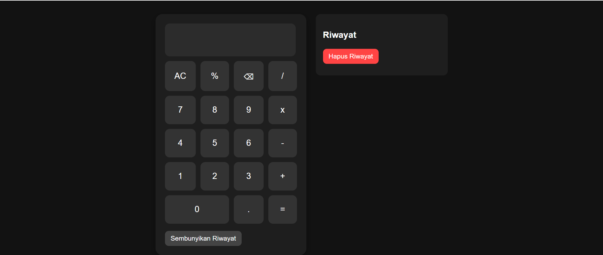

# 💻 Kalkulator Sederhana

Ini adalah proyek kalkulator berbasis HTML, CSS, dan JavaScript. Aplikasi ini mendukung operasi matematika dasar dan fitur tambahan seperti kalkulator ilmiah serta riwayat perhitungan.

## ✨ Fitur

- ✅ Operasi dasar: tambah, kurang, kali, bagi
- ✅ Kalkulator ilmiah: akar, pangkat, dll (toggle manual)
- ✅ Riwayat perhitungan (bisa ditampilkan/ disembunyikan)
- ✅ Tampilan responsif dan modern
- ✅ Transisi animasi halus untuk UI
- ✅ Desain fleksibel dan user-friendly


## 🖼️ Tampilan Aplikasi

 
https://teddylatief.github.io/Kalkulator-Sederhana/

## 🛠️ Teknologi yang Digunakan

- HTML5
- CSS3 (Flexbox + Media Queries)
- JavaScript (DOM manipulation)

## 📁 Struktur Folder

Kalkulator-Sederhana/
├── index.html # Halaman utama
├── style.css # Gaya tampilan
├── script.js # Logika kalkulator
└── README.md # Dokumentasi proyek


## 🚀 Cara Menjalankan Proyek

1. **Clone** repositori ini:

   ```bash
   git clone https://github.com/username/Kalkulator-Sederhana.git

2. **Masuk** ke Folder Proyek

  ```bash
  cd Kalkulator-Sederhana

3. **Jalankan** file index.html di browser favoritmu.


## 📌 Catatan Tambahan

Riwayat hanya tersimpan selama sesi browser (tidak permanen).

Tampilan sudah responsif, bisa digunakan di perangkat mobile maupun desktop.